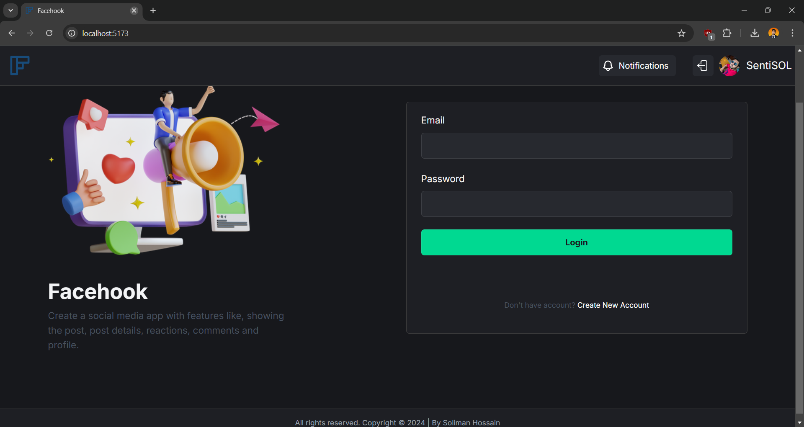

# FACEHOOK BY SOLIMAN



### FaceHook | [Code](https://github.com/solimanhossain/facehook/) | [Preview](https://solimanhossain-facehook.vercel.app) |

```
cd facehook
npm install
npm run dev
```

---

<br>

-   These project is done by myself ([Soliman Hossain](https://github.com/solimanhossain/)).

-   To run projects clone repo and install [Node.js](https://nodejs.org/en/download/) then run code on cmd or terminal follow url.
